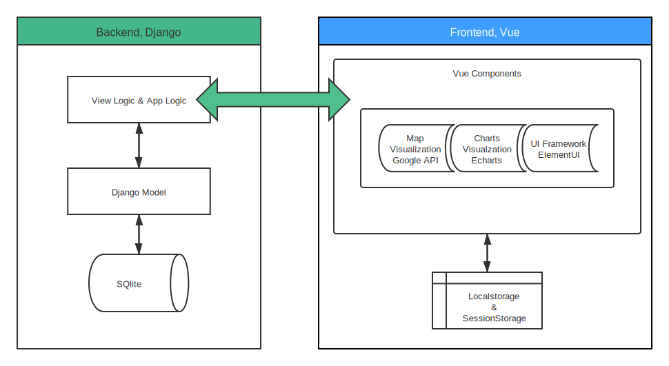
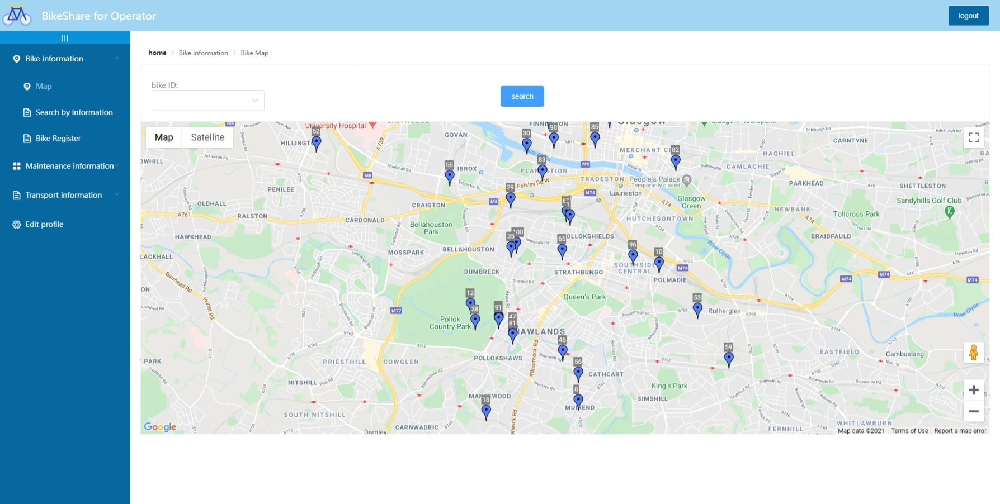
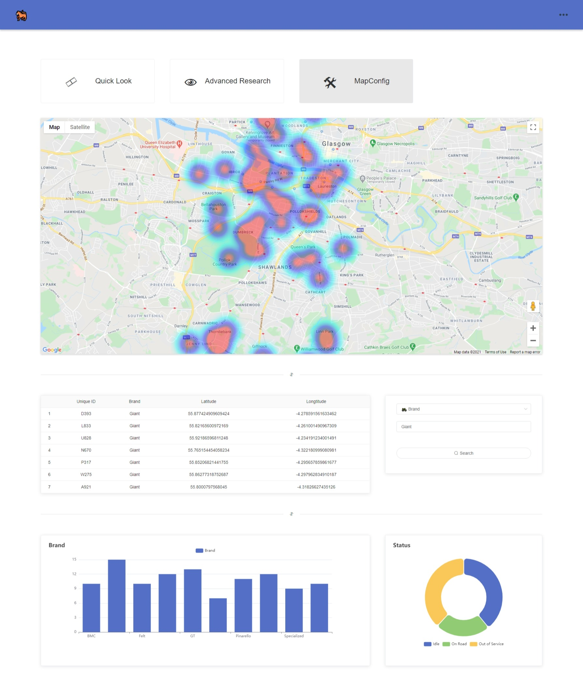
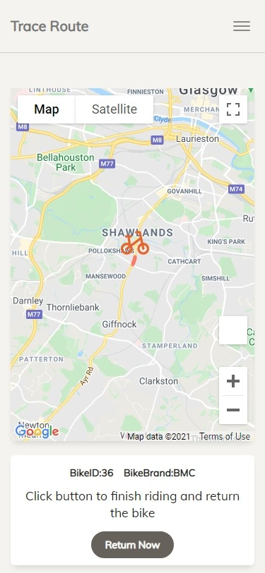

# 🚲 Bike Share System

COMPSCI4084 Programming and Systems Development Project

## 👀 Brief

[](https://docs.djangoproject.com/en/3.0/) [](https://vuejs.org/v2/guide/index.html) [](https://github.com/ecomfe/vue-echarts/) [](https://developers.google.com/maps/documentation) [](https://www.sqlite.org/index.html) [](https://element.eleme.io/#/en-US) []() []()

Bike sharing system is one among the major contributors for developing smart cities by providing efficient and environment-friendly mobility solutions. the team Lab 2a build this system based on web, with popular frontend and backend framework.

### frameworks in our system



## 🍎 Live demo

> ***(right click and copy the link address to your browser if you encounter refresh problem with links in README)***

[💿 the website running on Google Cloud](http://35.246.90.107/)

[🎞 the youtube video introducing this project](https://youtu.be/exWMVdhX82A)

##  📑 Quick Usage :: using Nginx Server

## before continue

[💿 Django (must)](https://docs.djangoproject.com/en/3.0/intro/install/) backend framework 

[💿 Nginx (must)](http://nginx.org/en/download.html) server

[💿 Node.js (if you want to run the development version of frontend)](https://nodejs.org/en/) frontend development framework. Because we have the released version in `/build/` so you are not supposed to install this strictly.

**<u>this guide have been proved to be available on the Windows machine.</u>** 

### step 1. install the requirements.txt

```sh
# content of requirements.txt
# you do not need to type them in your command line, it is shown just for the user who wanna install them individually or the people who are curious about our project architecture
Django==3.1.5
pygeohash==1.2.0
passlib==1.7.4
djangorestframework==3.12.2
django-cors-headers==3.7.0
```

run the `./install.sh` in main directory, or run the commands below

```shell
cd backend
pip install -r requirements.txt
```
### step 2. run the Django migrate to build models

```
python manage.py migrate
```
### step 3. setup the server

```shell
python manage.py runserver
------------------
# optional:: you can also appoint the port as you like, using the format:
# python manage.py runserver [ip:localhost]
```

### step 4. add the Nginx configuration

replace the `nginx-directory\conf\nginx.conf` with provided one, which is stored in the `build/nginx configuration`. (the `nginx-directory` means the location you install the Nginx). you may need to use different configuration with different OS.

modify the variable `ROOT` in Nginx configuration file

```shell
# for example, I put the `dist`(the released version of frontend) in `D:\Document\Project\build`
------------------
# in nginx.conf
server{
	...
	root D:/Document/Project/build/dist; # change it to your dist location
	...
}
```

### step 5. start the Nginx

```shell
cd 'Nginx directory' # Nginx directory is the location you install your Nginx
start nginx # if you are in Windows
./nginx # if you are in Linux
```

### step 6. visit the [bike share system](https://localhost:80)

```shell
https://localhost:80
// the default port may be 80
```

### Sign in

Except the customer system, the account of manager and operators are provided by the bike share system organization. You can register new operator and manager accounts in the manager system later. However, in the first time, two predefined accounts can be used for you to log in the operator/manager systems.

```
# operator account
username: sara password: 12345
# manager account
username: yif password: 0000
```

## 🌟 Features

see the **📕Document *#Chapter4 Design and Implementation***.

### screenshots (@see more in [screenshots](./images/screenshots/))

#### operator



#### manager



#### customer



## 📁 Three main directories

### in `/backend/`

`./BikeApp` the directory storing the application and `views.py` in Django structure

`./BikeShareSystem` the admin directory of Django, storing the holistic configuration `setting.py`

`./requirements` storing the dependencies list for the `install.sh`

### in `/frontend/`

the source code of Vue project

### in `/images/`

the screenshots of UX

### in `/build/`

the deployment version of frontend and Nginx configuration file

### rebuild the frontend

* setup the Nodejs environment  `npm install` <u>when you meet the problem of lack of `npm` dependencies</u>
* complies and hot-reloads for development `npm run serve` visit the frontend in the Nodejs
* complies and minifies for production `npm run build` (in most cases we use this instead of others)

## 🚴‍Contributors> Lab 2a

*Engie Dinana, Han LYU, Jinni Sun, Mathew Shaji, Vignesh Rajendran, Xiao LUO, Yifan Yuan, Yuzhou Long*